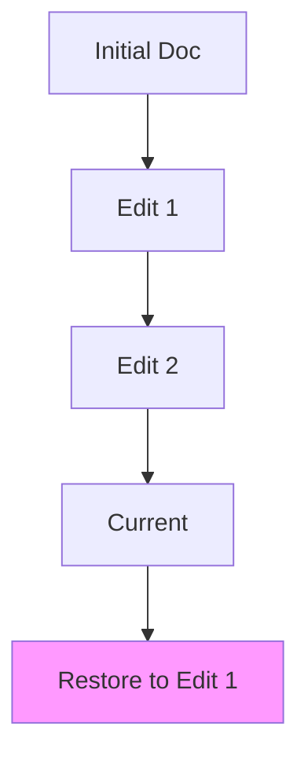

## Overview

RaaziSpace provides essential tools for managing project documentation efficiently. You can collaborate in real time, track changes with version history, search content quickly, and customize your docs to fit your needs. These features streamline workflows and improve team productivity.

<Columns cols={2}>
  <Card title="Collaborative Editing" icon="users" href="#collaborative-editing">
    Edit documents together with real-time updates and presence indicators.
  </Card>
  <Card title="Version History" icon="git-branch" href="#version-history">
    Track every change and revert to previous versions easily.
  </Card>
  <Card title="Search & Organization" icon="search" href="#search-organization">
    Find content fast with powerful search and tagging tools.
  </Card>
  <Card title="Customization" icon="settings" href="#customization">
    Tailor your docs with themes, layouts, and API integrations.
  </Card>
</Columns>

## Collaborative Editing and Real-Time Updates

Invite team members to edit docs simultaneously. RaaziSpace shows cursor positions and typing indicators, ensuring smooth collaboration.

<Callout kind="tip">
  Use `@mentions` to notify teammates directly in the editor.
</Callout>

Follow these steps to start collaborating:

<Steps>
  <Step title="Invite Collaborators" icon="user-plus">
    Open your doc and click the **Share** button in the top-right corner.
    
    Enter email addresses or generate a shareable link.
  </Step>
  <Step title="Real-Time Sync" icon="refresh-cw">
    Collaborators see changes instantly. Use the presence list to see who's online.
  </Step>
  <Step title="Resolve Conflicts" icon="alert-triangle">
    RaaziSpace auto-merges non-conflicting edits. Review and accept changes in the sidebar.
  </Step>
</Steps>

Integrate via API for programmatic access:

<CodeGroup tabs="JavaScript,Python">
  ```javascript
  const response = await fetch('https://api.example.com/docs/{docId}/collaborators', {
    method: 'POST',
    headers: { 'Authorization': `Bearer ${YOUR_API_KEY}` },
    body: JSON.stringify({ emails: ['user@example.com'] })
  });
  ```
  ```python
  import requests
  response = requests.post(
    'https://api.example.com/docs/{docId}/collaborators',
    headers={'Authorization': f'Bearer {YOUR_API_KEY}'},
    json={'emails': ['user@example.com']}
  )
  ```
</CodeGroup>

## Version History and Change Tracking

Every edit creates a new version. You can compare changes, restore previous states, or branch docs for experiments.



<Expandable title="Advanced Version Controls" default-open="false">
  Use the API to fetch version diffs:
  
  <ParamField path="docId" param-type="string" required="true">
    The document identifier.
  </ParamField>
  
  <ParamField query="version" param-type="number" required="false">
    Specific version number to compare.
  </ParamField>
</Expandable>

## Search and Organization Tools

Quickly locate content with full-text search across all docs. Organize using tags, folders, and outlines.

| Feature | Description | Example Use |
|---------|-------------|-------------|
| Full-Text Search | Searches titles, content, and tags | `project roadmap` |
| Tag Filtering | Apply and filter by custom tags | `#urgent #v2.0` |
| Folder Structure | Nested organization | `/projects/roadmap` |
| Outline View | Jump to sections | Auto-generated TOC |

<Tabs>
  <Tab title="Basic Search" icon="search">
    Type keywords in the global search bar to find matching docs.
  </Tab>
  <Tab title="Advanced Filters" icon="filter">
    Combine tags and dates: `API changes since:2024-01-01 #feature`.
  </Tab>
</Tabs>

## Customization Options for Docs

Personalize your documentation with themes, custom CSS, and embeds. Use the dashboard or API for programmatic changes.

<Columns cols={3}>
  <Card title="Themes" icon="palette" href="#">
    Switch between light/dark modes or upload custom styles.
  </Card>
  <Card title="Embeds" icon="code" href="#">
    Add interactive charts, videos, or live previews.
  </Card>
  <Card title="API Hooks" icon="plug" href="#">
    Extend with webhooks for custom workflows.
  </Card>
</Columns>

<Callout kind="info">
  Save customizations as templates for reuse across projects.
</Callout>